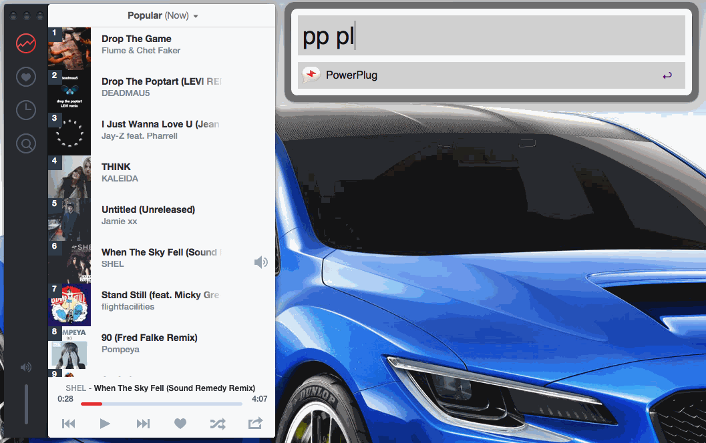

# PowerPlug

PowerPlug lets you easily control [Plug](http://www.plugformac.com/) from [Alfred](http://www.alfredapp.com/). PowerPlug is an Alfred [Workflow](http://support.alfredapp.com/workflows) that requires [Powerpack](http://www.alfredapp.com/powerpack/). Here's a quick look at how it works:

## Installation

Simply download [PowerPlug.alfredworkflow](https://github.com/stursby/PowerPlug/blob/master/PowerPlug.alfredworkflow?raw=true) and Double-click, and then click "Import".

For more info about installing Alfred Workflows, click [here](http://support.alfredapp.com/workflows:installing).

## Controls

To launch PowerPlug, simple type `"pp"` into Alfred followed by:

Example: `"pp next"` will skip to the next track.

#### Options

- `p`, `play`, `pause`, `toggle` : **Play** / **Pause**
- `next`, `skip` : **Next** track
- `prev`, `previous` : **Previous** track
- `open` : **Open** Plug app
- `quit` : **Quit** Plug app
- `min`, `minify` : **Minify** Plug app
- `max`, `expand` : **Expand** Plug app
- `love`, `fav`, `favorite` : **Favorite** current track
- `shuffle`, `random` : **Shuffle** tacks
- `share` : Open the **Share** window 

## License

Hyped is licensed [MIT](http://opensource.org/licenses/MIT)

* * *

Copyright (c) 2013 Charlie Hield
